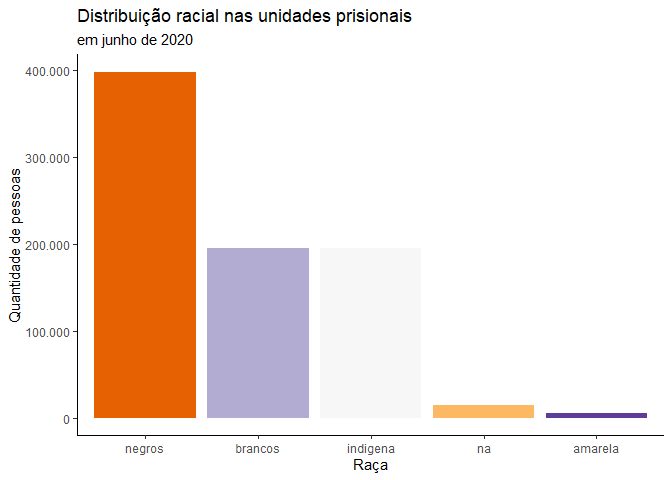

<!-- README.md is generated from README.Rmd. Please edit that file -->

# Introdução

## O que é esse pacote

No contexto do curso de [“Faxina de
Dados”](https://curso-r.com/cursos/faxina/) da Curso-R o trabalho final
consiste em realizar um projeto de faxina de dados em que possamos
aplicar os conceitos trabalhados no curso.

Escolhi, então, um tema de meu interesse (o [sistema
penitenciário](https://www.politize.com.br/sistema-prisional-e-direitos-humanos-entenda/))
e no presente projeto tento uma primeira versão de pacote que permita
acessar os dados do SISDEPEN de forma simples, facilitando análises
futuras.

Esses dados são coletados pelo [Departamento Penitenciário Nacional
(DEPEN)](https://www.gov.br/depen/pt-br) de todas as unidades prisionais
do país desde 2014. Primeiro uma vez ao ano e depois em duas rodadas
semestrais. As informações são em um formato de *survey* preenchidos
pelas próprias unidades.

Também, como forma de tentar contribuir com a comunidade, após os
feedbacks do projeto, espero poder submeter os dados ao excelente
projeto [Base dos Dados](https://basedosdados.org/). Por isso, o projeto
foi realizado tendo em mente as orientações da equipe do Base dos Dados:
<https://basedosdados.github.io/mais/colab_data/>

## Pequena observação: aspecto humano

Há uma frase, costumeiramente atribuída a Ghandi ou a Nelso Mandela, que
diz que “***É possível julgar o grau de civilização de uma sociedade
visitando suas prisões***”. Independente da autoria, a provocação é bem
válida.

O sistema penitenciário é uma realidade desconhecida. Temos centenas de
milhares de pessoas, presas, invisibilizadas porém concretas. Por razões
raciais, sócio-econômicas e culturais, a situação é convenientemente
escondida de nós e a sociedade, em geral, não se preocupa em entender e
conhecer essa realidade tão dura.

Aproveitando o ensejo do trabalho, tentei dar um pouco de concretude a
esse aspecto e a contribuir para que seja mais simples daqui pra frente
analisar e estudar essa realidade. Fica, então, desde já o convite para
explorar esse universo e a contribuir para uma sociedade em que nossos
prisioneiros são tratados com a devida dignidade e, assim, fazendo-nos
mais civilizados.

# Por que limpar?

Conforme aprendido no curso, em geral o melhor formato para análises é o
*tidy*, segundo o qual em uma base de dados devemos ter cada
observação/indivíduo em uma linha e cada variável em uma coluna.
Devemos, também, ter uma base sem informações duplicadas e com as
classes corretas (datas estão na classe `Date`e não `character`, por
exemplo).

A importância de ter os dados limpos e organizados foi bem exemplificada
pelo [Athos Damiani](https://twitter.com/athos_damiani), que certa vez
afirmou que “*Por trás de um grande gráfico há sempre uma grande
tabela*”.

## O que é a base

Como dito acima, escolhi a base do **SISDEPEN** para analisarmos. Ela é
resultado de um longo survey com diversas questões e é preenchido por um
responsável de cada Estado (podendo até ter diversos respondentes dentro
da mesma UF). Há perguntas mais e menos abertas e os dados não passam,
até onde se sabe, por nenhuma validação.

[Na página do
**DEPEN**](https://www.gov.br/depen/pt-br/sisdepen/mais-informacoes/bases-de-dados)são
disponibilizadas bases a partir de 2014, sendo a última delas a de junho
de 2020. Embora semestrais (e, portanto, a de dezembro de 2020 já esteja
respondida), há uma defasagem de quase um ano entre as bases
disponibilizadas.

Cada arquivo é disponibilizado em formato `.xlsx`

## Por que ela não é *tidy*?

Em um primeiro olhar poderíamos considerá-la uma base tidy uma vez que
cada linha corresponde a uma e somente uma unidade prisional do país.

Contudo, cada base possui cerca de 1.300 (*sim, mil e trezentas*)
colunas, sendo cada uma delas a resposta para uma pergunta do
formulário.

Assim, há variáveis em mais de uma coluna, as classes não estão
corretamente configuradas e as respostas categóricas precisam ser
padronizadas. Além disso, há casos em que não se tem certeza se um valor
NA é por ausência de uma resposta ou porque a pergunta não se aplica
àquele caso.

Por fim, o largo nome das colunas e o fato de não serem identicas ao
longo dos anos torna muito difícil o manuseio e impossível o
empilhamento direto.

# Como foi feita a organização

Em primeiro lugar fiz diversas análises exploratórias para entender
melhor as bases e verificar a utilidade de um trabalho de limpeza. Nessa
etapa foi bastante importante explorar através do pacote janitor e
analisar a documentação existente no documento do DEPEN que explica com
mais detalhes o instrumento de coleta
(<https://www.gov.br/depen/pt-br/sisdepen/mais-informacoes/bases-de-dados/bases-de-dados-1/formulario-sobre-informacoes-prisionais.pdf>)

## Escolhas feitas

Logo de início percebi que o esforço para organizar indiscriminadamente
as milhares de colunas seria pouco proveitoso. O formulário, por ser
muito abrangente, englobava todos os aspectos das políticas
penitenciárias e, por isso, faria sentido priorizar aspectos que eu
entedi mais relevantes.

Sem prejuízo de pretender analisar com mais profundidade todas as
questões num futuro, optei por priorizar variáveis que dissessem
respeito a:

-   informações sobre os estabelecimentos prisionais (localização, tipo
    de gestão, etc)
-   capacidade de custódia de cada unidade
-   lotação de cada unidade
-   tipos de crimes pelos quais as pessoas estão presas
-   perfil da população prisional (gênero, raça, idade, etc)

Por isso, foram priorizados os blocos 1, 4 e 5 do formulário do
SISDEPEN. Dentro de cada bloco, foram selecionadas as variáveis que mais
faziam sentido para análises futuras. Assim, ao invés de selecionar
todas as possíveis, foram “pinçadas” as colunas mais relevantes.

Também, considerando que o objetivo era também poder empilhar as tabelas
das diversas edições do SISDEPEN, fez sentido dividir em 4 bases
menores:

-   base dos estabelecimento (com dados gerais sobre as unidades
    prisionais)
-   base sobre a população prisional em geral (em que podemos ter
    informações sobre ocupação do sistema nos diversos regimes de pena)
-   base sobre perfil pessoal da população prisional (dados sobre raça,
    idade, etc)
-   base sobre perfil criminal (quais as incidências penais dessa
    população)

## Padrão adotado

Foi seguido, ao máximo possível, o guia de estilo do Base dos Dados e,
por isso, os nomes das colunas são bastante extensos e sempre que
disserem respeito a variáveis comuns a outras bases (como código IBGE,
sigla de UF, etc) seguiram o padrão deles.

Mais informações:
<https://basedosdados.github.io/mais/style_data/#formatos-de-valores>

## Funções

Para ajudar (ou melhor, viabilizar) o trabalho, foram construídas
funções que ajudavam em todo o ciclo de baixar e limpar e também para
serem “atalhos” de tarefas repetitivas.

Na pasta `/R/`existem os scripts:

-   `0-funcoes_auxiliares`: contendo atalhos e funções para apoiar as
    etapas do processo
-   `1-baixar_planilhas_xlsx_do_sisdepen`: que faz o scrap dos arquivos
    disponíveis no SISDEPEN e salva na pasta padrão do projeto
-   `2-carregar_base_sisdepen`: que carrega cada um dos arquivos .xslx
    baixados, mantendo as colunas-chave no formato adequado e
    padronizado
-   `3-dividir_em_blocos_e_renomear`: com as funções que dão origem a
    cada um dos blocos utilizados e uma função geral para iterar em
    todos os arquivos

Além disso, há o script `data.R` no qual estão documentadas todas as
bases geradas, com a descrição de cada uma das variáveis.

## Fluxo da limpeza

Na pasta `/data-raw/` estão os arquivos utilizados para efetivar o
processo de raspagem, limpeza e análise.

-   Há um script (`1-raspar_e_baixar_tabelas_sisdepen`) que realiza o
    processo de web scrap e obtém as tabelas do DEPEN, salvando na
    subpasta `/sisdepen/`

-   Os scripts `limpa_base_X` realizam o trabalho de carregar, dividir e
    montar cada uma das bases a ser exportada. Neles, também é realizado
    o processo de limpeza - em especial no script relativo à base
    estabelecimentos, uma vez que o maior número de variáveis
    categóricas (de texto) trouxe muito mais esforço na padronização.

-   Visando trazer mais utilidade, o script `extra_busca_cep` fornece
    uma base auxiliar contendo a latitude e longitude de cada um dos
    CEPs localizados das unidades. Esses dados foram incorporados na
    base dos estabelecimentos.

-   Por fim, há um script realizando as análises que serão incorporadas
    a esse README.

## Bases exportadas

Como resultado da análise, foram exportadas as 4 bases a seguir, salvas
na pasta`/data/` e carregadas automaticamente com o pacote:

-   `base_estabelecimento`
-   `base_populacao`
-   `base_perfilpessoal`
-   `base_perfilcriminal`

Cada uma delas **foi documentada**, com explicações de cada uma de suas
variáveis.

# Que análises podem ser feitas

Com as informações existentes já é possível realizar diversas análises
úteis (e, espero, interessantes). Vamos aqui testar algumas delas

## Quantidade de unidades prisionais existentes no país

<table>
<thead>
<tr>
<th style="text-align:right;">
Ano
</th>
<th style="text-align:left;">
Mês
</th>
<th style="text-align:right;">
Quantidade
</th>
</tr>
</thead>
<tbody>
<tr>
<td style="text-align:right;">
2.016
</td>
<td style="text-align:left;">
dezembro
</td>
<td style="text-align:right;">
1.479
</td>
</tr>
<tr>
<td style="text-align:right;">
2.017
</td>
<td style="text-align:left;">
dezembro
</td>
<td style="text-align:right;">
1.501
</td>
</tr>
<tr>
<td style="text-align:right;">
2.017
</td>
<td style="text-align:left;">
junho
</td>
<td style="text-align:right;">
1.508
</td>
</tr>
<tr>
<td style="text-align:right;">
2.018
</td>
<td style="text-align:left;">
dezembro
</td>
<td style="text-align:right;">
1.514
</td>
</tr>
<tr>
<td style="text-align:right;">
2.018
</td>
<td style="text-align:left;">
junho
</td>
<td style="text-align:right;">
1.506
</td>
</tr>
<tr>
<td style="text-align:right;">
2.019
</td>
<td style="text-align:left;">
dezembro
</td>
<td style="text-align:right;">
1.435
</td>
</tr>
<tr>
<td style="text-align:right;">
2.019
</td>
<td style="text-align:left;">
junho
</td>
<td style="text-align:right;">
1.411
</td>
</tr>
<tr>
<td style="text-align:right;">
2.020
</td>
<td style="text-align:left;">
junho
</td>
<td style="text-align:right;">
1.444
</td>
</tr>
</tbody>
</table>

### Distribuição das unidades por estados

<table>
<thead>
<tr>
<th style="text-align:left;">
UF
</th>
<th style="text-align:left;">
2014
</th>
<th style="text-align:left;">
2020
</th>
</tr>
</thead>
<tbody>
<tr>
<td style="text-align:left;">
MG
</td>
<td style="text-align:left;">
12.9%
</td>
<td style="text-align:left;">
15.9%
</td>
</tr>
<tr>
<td style="text-align:left;">
SP
</td>
<td style="text-align:left;">
11.4%
</td>
<td style="text-align:left;">
13.0%
</td>
</tr>
<tr>
<td style="text-align:left;">
RS
</td>
<td style="text-align:left;">
6.7%
</td>
<td style="text-align:left;">
7.8%
</td>
</tr>
<tr>
<td style="text-align:left;">
GO
</td>
<td style="text-align:left;">
6.7%
</td>
<td style="text-align:left;">
7.2%
</td>
</tr>
<tr>
<td style="text-align:left;">
PB
</td>
<td style="text-align:left;">
5.5%
</td>
<td style="text-align:left;">
5.1%
</td>
</tr>
<tr>
<td style="text-align:left;">
PE
</td>
<td style="text-align:left;">
5.4%
</td>
<td style="text-align:left;">
5.1%
</td>
</tr>
<tr>
<td style="text-align:left;">
PR
</td>
<td style="text-align:left;">
2.5%
</td>
<td style="text-align:left;">
4.8%
</td>
</tr>
<tr>
<td style="text-align:left;">
MA
</td>
<td style="text-align:left;">
2.2%
</td>
<td style="text-align:left;">
3.7%
</td>
</tr>
<tr>
<td style="text-align:left;">
SC
</td>
<td style="text-align:left;">
3.2%
</td>
<td style="text-align:left;">
3.6%
</td>
</tr>
<tr>
<td style="text-align:left;">
PA
</td>
<td style="text-align:left;">
2.9%
</td>
<td style="text-align:left;">
3.5%
</td>
</tr>
<tr>
<td style="text-align:left;">
RJ
</td>
<td style="text-align:left;">
3.5%
</td>
<td style="text-align:left;">
3.5%
</td>
</tr>
<tr>
<td style="text-align:left;">
RO
</td>
<td style="text-align:left;">
3.5%
</td>
<td style="text-align:left;">
3.5%
</td>
</tr>
<tr>
<td style="text-align:left;">
MT
</td>
<td style="text-align:left;">
4.1%
</td>
<td style="text-align:left;">
3.4%
</td>
</tr>
<tr>
<td style="text-align:left;">
MS
</td>
<td style="text-align:left;">
3.1%
</td>
<td style="text-align:left;">
3.0%
</td>
</tr>
<tr>
<td style="text-align:left;">
TO
</td>
<td style="text-align:left;">
3.0%
</td>
<td style="text-align:left;">
2.6%
</td>
</tr>
<tr>
<td style="text-align:left;">
ES
</td>
<td style="text-align:left;">
2.5%
</td>
<td style="text-align:left;">
2.4%
</td>
</tr>
<tr>
<td style="text-align:left;">
CE
</td>
<td style="text-align:left;">
11.1%
</td>
<td style="text-align:left;">
2.2%
</td>
</tr>
<tr>
<td style="text-align:left;">
BA
</td>
<td style="text-align:left;">
1.5%
</td>
<td style="text-align:left;">
1.7%
</td>
</tr>
<tr>
<td style="text-align:left;">
AM
</td>
<td style="text-align:left;">
1.4%
</td>
<td style="text-align:left;">
1.5%
</td>
</tr>
<tr>
<td style="text-align:left;">
PI
</td>
<td style="text-align:left;">
0.9%
</td>
<td style="text-align:left;">
1.2%
</td>
</tr>
<tr>
<td style="text-align:left;">
RN
</td>
<td style="text-align:left;">
2.2%
</td>
<td style="text-align:left;">
1.2%
</td>
</tr>
<tr>
<td style="text-align:left;">
AC
</td>
<td style="text-align:left;">
0.8%
</td>
<td style="text-align:left;">
1.0%
</td>
</tr>
<tr>
<td style="text-align:left;">
AL
</td>
<td style="text-align:left;">
0.6%
</td>
<td style="text-align:left;">
0.8%
</td>
</tr>
<tr>
<td style="text-align:left;">
SE
</td>
<td style="text-align:left;">
0.6%
</td>
<td style="text-align:left;">
0.7%
</td>
</tr>
<tr>
<td style="text-align:left;">
DF
</td>
<td style="text-align:left;">
0.4%
</td>
<td style="text-align:left;">
0.6%
</td>
</tr>
<tr>
<td style="text-align:left;">
AP
</td>
<td style="text-align:left;">
0.6%
</td>
<td style="text-align:left;">
0.6%
</td>
</tr>
<tr>
<td style="text-align:left;">
RR
</td>
<td style="text-align:left;">
0.4%
</td>
<td style="text-align:left;">
0.4%
</td>
</tr>
<tr>
<td style="text-align:left;">
União
</td>
<td style="text-align:left;">
0.3%
</td>
<td style="text-align:left;">

-   </td>
    </tr>
    </tbody>
    </table>

## Tipo de gestão das unidades

## Quantidade de presos provisórios por Estado

\# quantidade de presos por estado

\# quantidade de vagas por estado

\# superlotação por estado

\# proporção de crimes

\# quantidade de homens e mulheres

## Comparação entre homens e mulheres presos

## Distribuição racial nos presídios

Fica bastante evidente uma “predileção” por pessoas negras (aqui
consideradas pretas e pardas) no sistema penitenciário. Chama atenção,
também, a relevante proporção de raça não informada.

## Distribuição por faixas etárias

Fica claro, por fim, a grande quantidade de jovens no sistema: a maior
parte das pessoas presas está na faixa abaixo dos 30 anos de idade.

# TODO

-   Corrigir a leitura das bases dos anos de 2014 e 2015

-   Ampliar para todas as outras perguntas do SISDEPEN

-   Outras análises: taxa de encarceramento, observar as proporções de
    incidências penais, observar com mais atenção se o HC coletivo para
    mães e gestantes teve impacto, etc.
